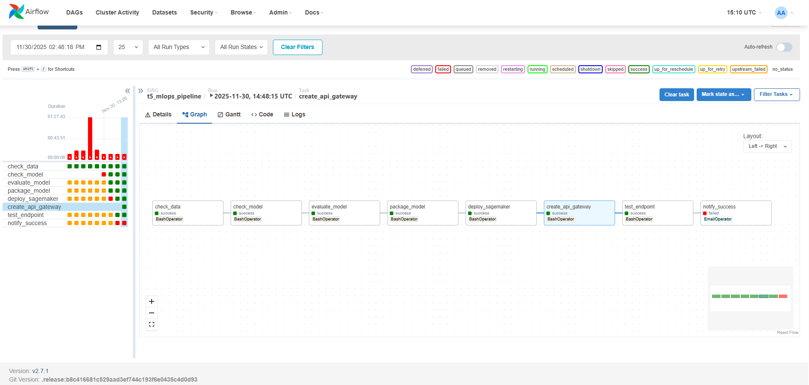

# T5 Sentiment Analysis MLOps Pipeline

This project implements an end-to-end MLOps pipeline for a custom **T5 Sentiment Analysis Model**. It features a specialized T5 Encoder with a "Sentiment Gate" architecture, deployed to **AWS SageMaker Serverless Inference**, and orchestrated by **Apache Airflow**.

## 🧠 Model Architecture

The core of this project is a custom `T5ForSentimentClassification` model that modifies the standard T5 architecture for efficient and interpretable binary sentiment classification.

<!--  -->

### Key Components:
1.  **T5 Encoder Backbone**: We use only the encoder part of `t5-small`. This reduces inference latency significantly compared to the full encoder-decoder architecture, as we don't need to generate text token-by-token.
2.  **Sentiment Gate**: A learnable attention mechanism (Linear layer + Sigmoid) that assigns an "importance score" ($0$ to $1$) to each token's hidden state. This allows the model to focus on sentiment-bearing words (e.g., "loved", "terrible") while ignoring neutral ones.
3.  **Weighted Pooling**: Instead of simple mean pooling, we compute a weighted sum of the encoder's hidden states using the gate scores.
    $$ h_{pooled} = \frac{\sum (h_i \times g_i)}{\sum g_i} $$
4.  **Classification Head**: A final dense layer maps the pooled representation to 2 classes (Negative/Positive).

### Reinforcement Learning (RL) Optimization
The model supports an optional RL training loop where the Gate is treated as a policy. It uses the **REINFORCE** algorithm to optimize the gate to maximize classification accuracy, encouraging it to select the most predictive tokens.

---

## 🔄 MLOps Pipeline

The entire lifecycle of the model is automated using **Apache Airflow**, ensuring reproducibility and continuous delivery.



### Pipeline Steps:
1.  **Check Data**: Validates that the SST-2 dataset is available and correctly formatted.
2.  **Train / Check Model**:
    *   Checks if a pre-trained model exists locally (hybrid workflow).
    *   If not, triggers a training job (supports GPU acceleration).
3.  **Evaluate**: Runs the model against the validation set to ensure performance metrics (Accuracy > 90%) are met.
4.  **Package Model**: Compresses the model artifacts (`pytorch_model.bin`, `config.json`, `tokenizer`) and inference scripts (`inference.py`) into a `model.tar.gz` file compatible with SageMaker.
5.  **Deploy to SageMaker**:
    *   Uploads artifacts to S3.
    *   Creates/Updates a **SageMaker Serverless Endpoint**.
    *   Configures auto-scaling (0 to N instances).
6.  **Create API Gateway**:
    *   Deploys an **AWS Lambda** function to act as a proxy.
    *   Sets up an **API Gateway** HTTP API to expose the model publicly.
7.  **Test Endpoint**: Sends a test request ("I love this movie") to the live API to verify end-to-end functionality.
8.  **Notify**: Sends an email alert upon success or failure.

---

## 📂 Project Structure

```
t5-aws-mlops-pipeline/
├── airflow/                 # Airflow configuration & DAGs
│   ├── dags/                # Pipeline definitions (t5_mlops_pipeline.py)
│   ├── docker-compose.yaml  # Airflow infrastructure
│   └── Dockerfile           # Custom Airflow image with AWS CLI & ML deps
├── aws_deploy/              # AWS Deployment Scripts
│   ├── code/                # Inference scripts (inference.py)
│   ├── deploy_sagemaker.py  # SageMaker deployment logic
│   ├── create_api_gateway.py# API Gateway & Lambda setup
│   └── package_model.py     # Artifact packaging
├── modules/                 # Core Model Code
│   ├── models/              # Custom T5 Architecture (t5_sentiment_gate.py)
│   ├── data/                # Data processing (SST-2)
│   └── training/            # Training loop
├── t5-classification/       # Model Artifacts (Local)
├── assets/                  # Diagrams and images
├── train.py                 # Training entry point
├── evaluate.py              # Evaluation entry point
└── requirements.txt         # Python dependencies
```

## 🛠️ Setup & Installation

### Prerequisites
*   **Docker Desktop** (running on Windows/Linux/Mac)
*   **AWS Account** with access keys
*   **Python 3.9+** (for local testing)

### 1. Configure Credentials
Create an `.env` file in the `airflow/` directory:
```bash
cp airflow/.env.example airflow/.env
```
Edit `airflow/.env` and add your AWS keys:
```env
AWS_ACCESS_KEY_ID=your_access_key
AWS_SECRET_ACCESS_KEY=your_secret_key
AWS_DEFAULT_REGION=us-east-1
AIRFLOW_UID=50000
```

### 2. Start Airflow
Run the following from the `airflow/` directory:
```bash
docker-compose up -d --build
```
Access the Airflow UI at [http://localhost:8080](http://localhost:8080) (User/Pass: `admin`/`admin`).

## 🏃‍♂️ Running the Pipeline

1.  **Trigger DAG**: In the Airflow UI, find `t5_mlops_pipeline`, unpause it, and click the **Play** button.
2.  **Monitor**: Watch the tasks turn green in the Graph view.
3.  **Result**: You will receive an email notification, and your API will be live!

## 🔌 API Usage

**Endpoint**: `POST https://<api-id>.execute-api.us-east-1.amazonaws.com/predict`

**Request Body**:
```json
{
  "inputs": "I absolutely loved this movie! It was fantastic."
}
```

**Response**:
```json
{
  "label": "POSITIVE",
  "score": 0.98
}
```
